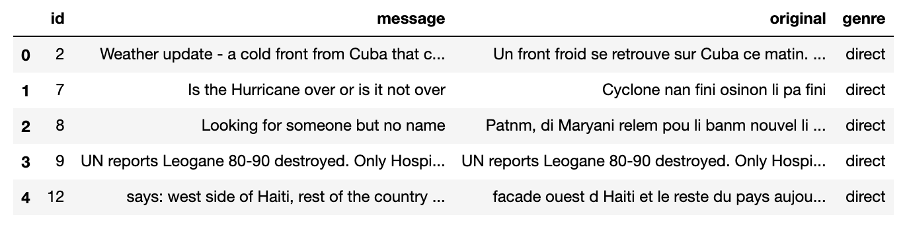
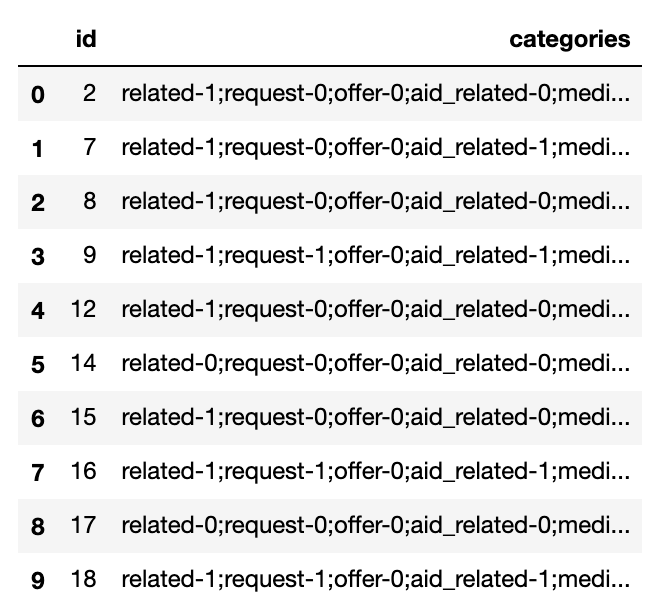
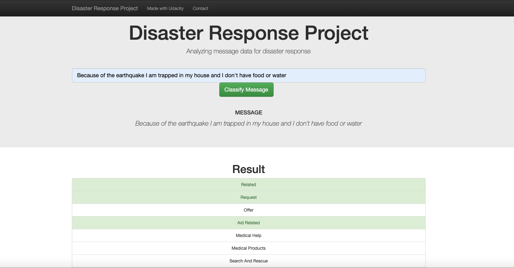
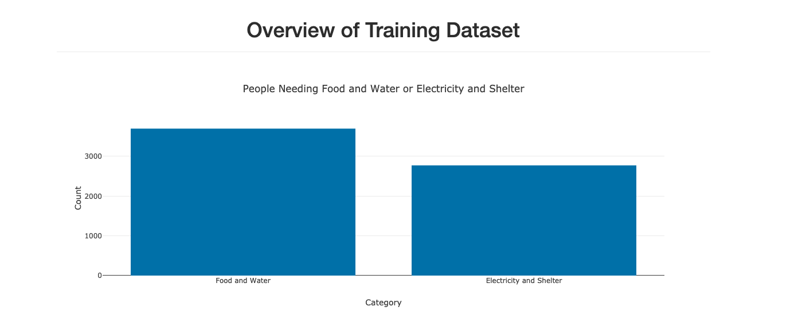
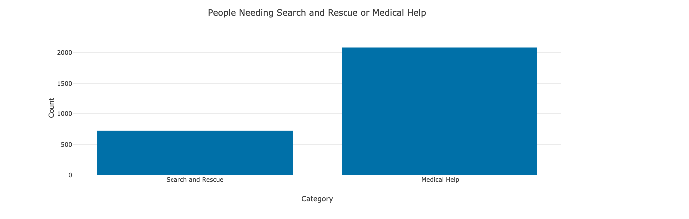

# Disaster Response Pipeline Project
The goal of this project was to get experience using natural lanugage processing and machine learning to classify tweets from disaster victims. The model was deployed to a web application which allowed the user to type in some text and the message classifications are displayed so that the user has a better idea how the model works. This application also displays some visualizations based on aggregations on the training data. 

The data used for this project was provided by [Figure Eight](https://www.figure-eight.com/)

### Files 
##### app 
* templates - templates provided by udacity for web page
* run.py - python file to launch the web app 
##### data 
* DisasterResponse.db - database created by process_data.py file
* disaster_categories.csv - categories that messages can be labeled with
* disaster_messages.csv - tweets from disasters 
* process_data.py - python file which processes the data and loads it into DisasterResponse.db

##### exploratory_notebooks 
* ETL Pipeline Preperation.ipynb - played with the data in order to figure out best way to process data
* ML Pipeline Preperation.ipynb - used this notebook to create the NLP and ML pipelines 

##### models
* classifier.pkl - pickle file created by train_classifier.py in order to save the model
* train_classifier.py - python file which builds, trains and evaluates the model 

### Instructions
1. Run the following commands in the project's root directory to set up your database and model.
    - To run ETL pipeline that cleans data and stores in database  
        `python data/process_data.py data/disaster_messages.csv data/disaster_categories.csv data/DisasterResponse.db`  
    - To run ML pipeline that trains classifier and saves  
        `python models/train_classifier.py data/DisasterResponse.db models/classifier.pkl`  
2. Run the following command in the app's directory to run your web app.  
    `python run.py`

3. Go to http://0.0.0.0:3001/

### View of Data
#### Messages Data
  
#### Categories Data
  

### Data Cleaning 
When process_data.py is run the following things are done
* Reads data in from csv files and merges the two together into one dataframe
* Converts category feature from its current format into 36 indicator variables
* Saves the data into a database 

### Building the Model
When traing_classifier.py is run the following things are done
* Loads the data from a database and seperates predictor and response variables
* Tokenizes each value in the message column using word_tokenize()
* Converts every message to lower case and converts every word to its root form using a lemmatizer
* Uses sklearns Pipeline feature to implement CountVectorizer, TfidfTransformer and MultiOutputClassifier using AdaBoost for for the classifier
* Creates a GridSearchCV object to optimize parameters for the model 
* Returns accuracy score, weighted precision score and weighted recall score
* Saves the model as a pickle file 

### Web app 
Right when you arrive to the web app you will see a place to type in a message. Typing in a message and clicking the classify message box will return classification results for that message
  

The home page of the web app also contains some visualizations of the data  
  

